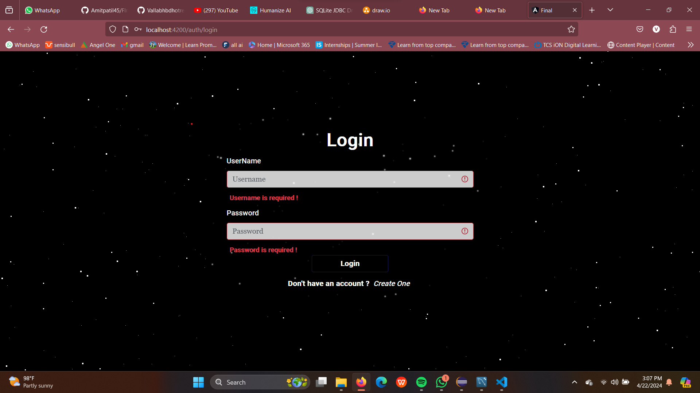
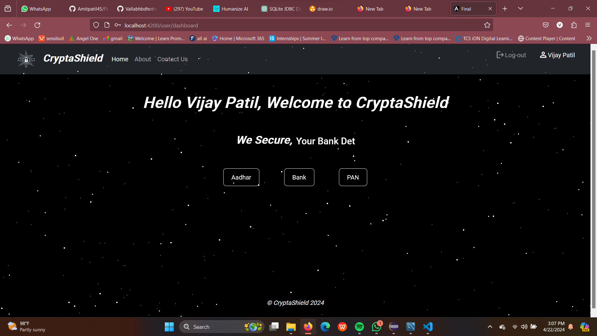

# FinalYearProjectSecureVault

An online secure document vault system developed using Java and React.

## 🔒 Features
- User Registration and Login
- Upload and Securely Store Documents
- Admin Panel
- Role-Based Access

## 📸 Snapshots

### 🔐 Login Page

### 🏠 Homepage

### 📁 Dashboard

## ⚙️ Technologies Used
- AngularJS
- Java Spring Boot
- MySQL
- JWT Authentication

## 🧑‍💻 Team Members
- Vijay Patil

